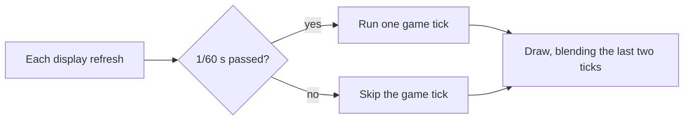

# SMOInterp

Super Mario Odyssey at your display's refresh rate (120 Hz, 144 Hz, and so on) in yuzu-based emulators ([Eden](https://eden-emu.dev), yuzu, Citron, Sudachi), without speeding the game up.

SMO's logic is built around exactly 60 steps per second, so simply unlocking the frame rate makes the whole game run faster. SMOInterp keeps the logic at 60 Hz and draws extra frames in between. Each extra frame blends the camera, every model and the particle effects between the last two logic steps, so motion is smooth.



It's a code mod built with [exlaunch](https://github.com/shadowninja108/exlaunch), not a `.pchtxt` patch. For how it works and why each hook exists, see [docs/internals.md](docs/internals.md).

## Requirements

- Super Mario Odyssey **1.0.0**. The mod checks the game version and does nothing on any other version.
- Eden, yuzu, or another yuzu-based emulator (Citron, Sudachi), on Windows, Linux or Android

## Install

1. Right-click SMO in your emulator → **Properties → Add-ons** and **uncheck the Update**, so the game runs as 1.0.0. Back up your save first.
2. Download the zip from [Releases](../../releases) and extract it into the emulator's `load` folder, so you end up with `load/0100000000010000/SMOInterp/exefs/`. The easiest way to find `load` is to right-click SMO → **Open Mod Data Location** and go up one folder. Or:

   | Emulator | Linux | Windows |
   |---|---|---|
   | Eden | `~/.local/share/eden/load/` | `%APPDATA%\eden\load\` |
   | yuzu | `~/.local/share/yuzu/load/` | `%APPDATA%\yuzu\load\` |
   | yuzu (Flatpak) | `~/.var/app/org.yuzu_emu.yuzu/data/yuzu/load/` | |

3. Check that **SMOInterp** is ticked in the Add-ons list, then start the game.
4. Optional: create `SMOInterp/config.ini` in the emulator's `sdmc` folder, which sits next to `load` (for example `~/.local/share/yuzu/sdmc/SMOInterp/config.ini`):

   ```ini
   fps = 120            # your display's refresh rate
   interpolation = on   # off = no blending, for comparison
   ```

   Without the file, it runs at 120 fps with interpolation on. Restart the game after editing it.

## Build

```sh
make            # builds into deploy/
make package    # makes the release zip
make clean
```

With `DEVKITPRO` set, this uses your local devkitA64. Without it, it runs inside the `devkitpro/devkita64` container (podman or docker).

GitHub Actions builds every push. Pushing a `v*` tag publishes a release.

## Known limits

- Button presses still register at 60 Hz, and the picture runs one logic step (16.7 ms) behind.
- HUD animations still step at 60 Hz.
- Not yet tested: bosses, Odyssey warps, snapshot mode, 2-player mode, moon cutscenes.

## Credits

- [exlaunch](https://github.com/shadowninja108/exlaunch) by shadowninja108
- [OdysseyDecomp](https://github.com/MonsterDruide1/OdysseyDecomp) for symbols and structure layouts
- [Eden](https://eden-emu.dev), whose crash backtraces made debugging possible

## License

GPL-2.0, inherited from exlaunch. This repository contains no Nintendo code or assets.
