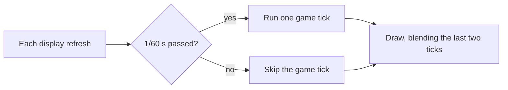

# SMOInterp

Super Mario Odyssey at your display's refresh rate (120 Hz, 144 Hz, and so on) in yuzu-based emulators ([Eden](https://eden-emu.dev), yuzu, Citron, Sudachi), without speeding the game up.

SMO's logic is built around exactly 60 steps per second, so simply unlocking the frame rate makes the whole game run faster. SMOInterp keeps the logic at 60 Hz and draws extra frames in between. Each extra frame blends the camera, every model and the particle effects between the last two logic steps, so motion is smooth.


```mermaid
flowchart LR
    T[Each display refresh] --> Q{1/60 s passed?}
    Q -- yes --> L[Run one game tick]
    Q -- no --> S[Skip the game tick]
    L --> D[Draw, blending the last two ticks]
    S --> D
```

It's a code mod built with [exlaunch](https://github.com/shadowninja108/exlaunch), not a `.pchtxt` patch. For how it works and why each hook exists, see [docs/internals.md](docs/internals.md).

## Requirements

- Super Mario Odyssey **1.0.0**. The mod checks the game version and does nothing on any other version.
- Eden, yuzu, or another yuzu-based emulator (Citron, Sudachi), on Windows, Linux or Android

## Install

1. Right-click SMO in your emulator → **Properties → Add-ons** and **uncheck the Update**, so the game runs as 1.0.0. Back up your save first.
2. Download the zip from [Releases](../../releases) and extract it into the emulator's `load` folder, so you end up with `load/0100000000010000/SMOInterp/exefs/`. The easiest way to find `load` is to right-click SMO → **Open Mod Data Location** and go up one folder. Or:

   | Emulator | Linux | Windows |
   |---|---|---|
   | Eden | `~/.local/share/eden/load/` | `%APPDATA%\eden\load\` |
   | yuzu | `~/.local/share/yuzu/load/` | `%APPDATA%\yuzu\load\` |
   | yuzu (Flatpak) | `~/.var/app/org.yuzu_emu.yuzu/data/yuzu/load/` | |

3. Check that **SMOInterp** is ticked in the Add-ons list, then start the game.
4. Optional: create `SMOInterp/config.ini` in the emulator's `sdmc` folder, which sits next to `load` (for example `~/.local/share/yuzu/sdmc/SMOInterp/config.ini`):

   ```ini
   fps = 120            # your display's refresh rate
   interpolation = on   # on, extrapolate, or off (see below)
   ```

   Without the file, it runs at 120 fps with interpolation on. Restart the game after editing it.

   `interpolation` picks how the extra frames are made:
   - `on` blends the last two game steps. It's the smoothest, but the picture runs up to one step (16.7 ms) behind.
   - `extrapolate` continues each motion past the newest step instead, so there's no added delay. When something stops or turns suddenly, it can overshoot for a frame.
   - `off` shows each game step as it is, so motion looks like 60 fps. Use it for comparison.

## Build

```sh
make            # builds into deploy/
make package    # makes the release zip
make clean
make format     # clang-format the mod's code in source/program
```

With `DEVKITPRO` set, this uses your local devkitA64. Without it, it runs inside the `devkitpro/devkita64` container (podman or docker).

GitHub Actions builds every push. Pushing a `v*` tag publishes a release.

## Known Bugs / TODO

- Button presses still register at 60 Hz. With `interpolation = on` the picture runs up to one logic step (16.7 ms) behind; `extrapolate` avoids that but has the possibility of overshooting for a frame.
- HUD isn't interpolated. I don't think this matters that much. If someone wants to pr and make it work go for it. 

## How it works

SMOInterp doesn't change any bytes in the game's files. The emulator loads it as an extra code module (`subsdk9`) next to the game, and it patches the game **in memory** when the game starts.

### 1. Checking the game version

Every address below belongs to SMO 1.0.0 only. Before touching anything, the mod reads the build ID that is mapped in memory at `main+0x1c4d024` and compares it with 1.0.0's:

```
3C A1 2D FA AF 9C 82 DA 06 4D 16 98 DF 79 CD A1
```

If it doesn't match, it logs `main is not SMO 1.0.0` and installs nothing. Hooking the wrong build would overwrite random code.

### 2. Hooking a function

For each function it needs, [exlaunch](https://github.com/shadowninja108/exlaunch) overwrites the function's **first instruction** with a branch to the mod's code. The instruction it replaced is copied into a small trampoline, so the mod can still call the original function.

```
main+0x536614   GameSystem::movement           (the game's 60 Hz tick)

  before:   <first instruction>                ; the game's own code
            ...

  after:    14xxxxxx   b   GameSystemMovement::Callback   ; SMOInterp
            ...

  trampoline (inside SMOInterp):
            <first instruction>                ; relocated original
            b   main+0x536618                  ; continue into the real function
```

When the mod's code is further than a single `b` can reach (±128 MB), exlaunch writes `58000051 LDR X17, #8` / `d61f0220 BR X17` followed by the 64-bit address instead.

The callback then decides what happens. For `GameSystem::movement`, it calls the original (`Orig(...)`) only when 1/60 s of real time has passed. On the frames in between, it skips the tick and repeats only the rendering work.

### 3. What each hook does

All addresses are offsets from the start of the game's `main` executable, taken from [OdysseyDecomp](https://github.com/MonsterDruide1/OdysseyDecomp)'s `data/file_list.yml`.

| Address | Function | What SMOInterp does |
|---|---|---|
| `0x8a6ab4` | `al::GameFrameworkNx::procFrame_` | Measures real time each frame and decides whether a 60 Hz game step is due. |
| `0x536614` | `GameSystem::movement` | Runs the real game step only when it's due. Otherwise repeats the scene's rendering work without the simulation. |
| `0x75b9a0` | `sead::ControllerMgr::calc` | Polls controllers only on game steps, so button presses aren't lost. |
| `0x8c23fc` | `PrePassLightKeeper::execute` | Skipped on in-between frames, so lights don't overflow their buffer and go dark. |
| `0x9d0ce4` | `al::updateKitListPostOnNerveEnd` | Remembers which scene to redraw on in-between frames. |
| `0x910650` | `al::LiveActorKit::preDrawGraphics` | Records each step's camera and writes the blended camera before the renderer copies it. |
| `0x93fe7c` | `al::ModelCtrl::updateModelDrawBuffer` | Blends every model's bone matrices around the GPU upload, then restores the real ones. |
| `0x93fbc0` | `al::ModelCtrl::updateGpuBuffer` | Same, for the other upload path. |
| `0xb2b274` | `nn::vfx::EmitterSet::Calculate` | Blends where each particle effect is anchored. |
| `0xb2a928` | `nn::vfx::EmitterSet::Initialize` | Forgets the history of a recycled effect slot. |
| `0x887454` | `al::EffectSystem::preprocess` | Recorded on game steps and repeated on in-between frames. |
| `0xb38fd4` | `nn::vfx::System::Calculate` | Advances particles by each frame's share of a step instead of a whole step. |
| `0x8799b4` | `GraphicsSystemInfo::updatePartsGraphics` | Same for water, sky and clouds, which would otherwise animate at double speed. |
| `0x899510` | `FluidSimulateWave::update` | Water ripples only step on game steps. |
| `0x9ce52c` | `al::Scene::~Scene` | Clears all saved history when a scene is unloaded. |

One more hook sets the frame rate. SMO looks up its graphics (NVN) functions by name at runtime, so the mod hooks that lookup (`nvnBootstrapLoader`) and swaps `nvnWindowSetPresentInterval` / `nvnWindowBuilderSetPresentInterval` for versions that ask Eden for your `fps` instead of 60.

The blending never changes the game's own state. Every blended value is written just before the renderer reads it and put back straight afterwards, so the simulation only ever sees its real values. For the full story, including every approach that didn't work and why, see [docs/internals.md](docs/internals.md).

## Credits

- [exlaunch](https://github.com/shadowninja108/exlaunch) by shadowninja108
- [OdysseyDecomp](https://github.com/MonsterDruide1/OdysseyDecomp) for symbols and structure layouts
- [Eden](https://eden-emu.dev), whose crash backtraces made debugging possible

## License

GPL-2.0, inherited from exlaunch. This repository contains no Nintendo code or assets.
