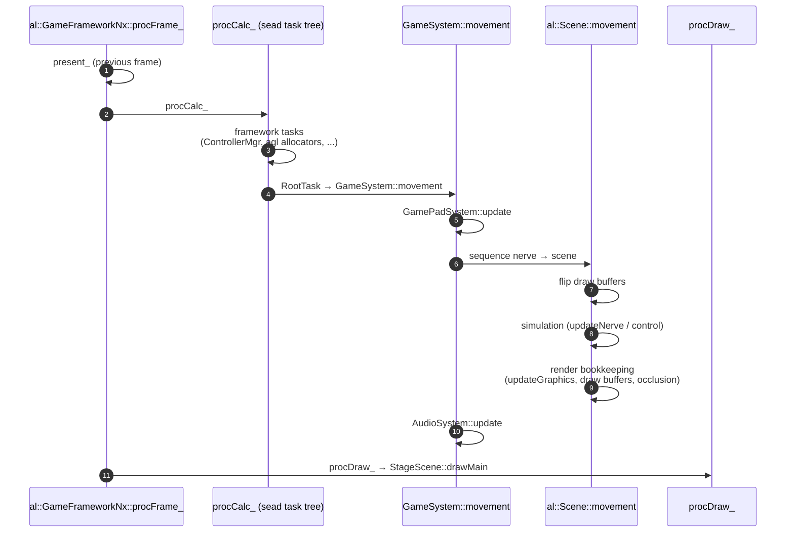
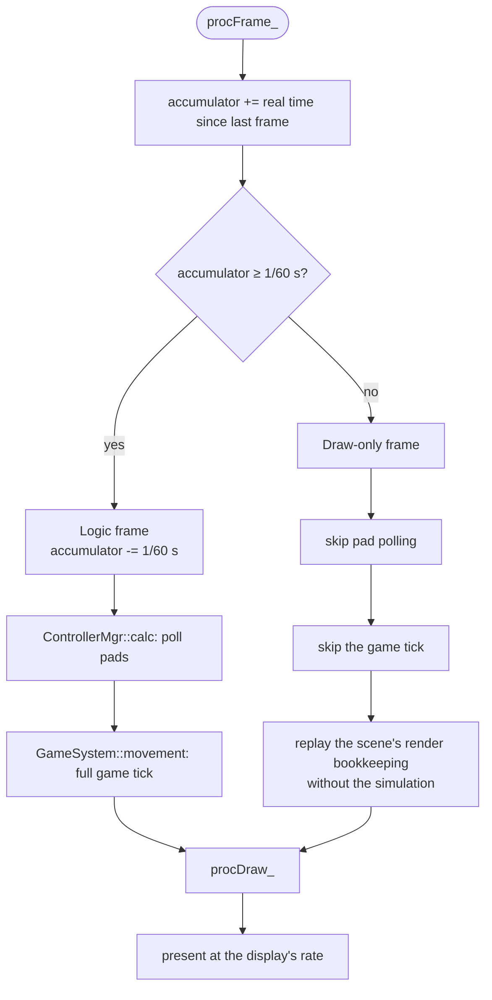
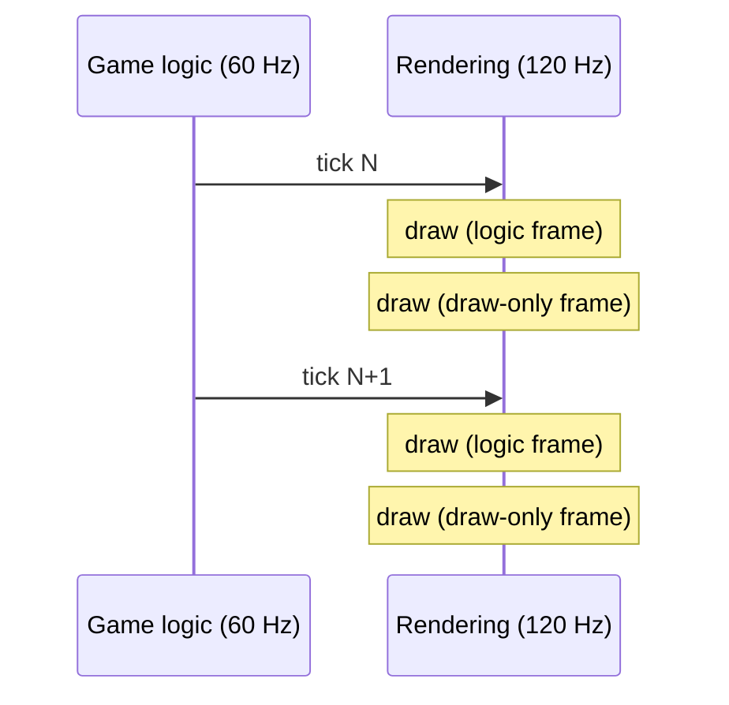
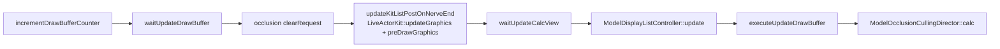

# How SMOInterp works

## The vanilla frame

Once per vsync, `al::GameFrameworkNx::procFrame_` runs the entire frame: present the previous image, run logic, draw.

## What SMOInterp changes

A fixed-timestep accumulator on the Switch system tick decides, once per rendered frame, whether a 60 Hz logic step is due.

On a 120 Hz display, each logic step is drawn twice:

## Where the gate sits, and why

Choosing the gate was most of the work. Each attempt below was tested in-game; the backtraces came from Eden's symbolized crash logs.

| Gate attempt | Result | Why |
|---|---|---|
| Skip all of `procCalc_` | Black screen, then crash in `agl::pfx::Bloom` | agl's `DynamicTextureAllocator` defers texture frees and expects one calc per draw. Extra draws overflowed its deferred-free list, and a texture was freed twice. |
| Skip `GameSystem::movement` only | 3D scene black, HUD fine, later crash | `al::Scene::movement` also does the scene's render bookkeeping (draw-buffer flip, graphics update). |
| + replay `updateKitListPostOnNerveEnd` | Renders, but buildings flicker | `ModelOcclusionCullingDirector::update` *appends* every query and only the tick clears them; the draw buffers and occlusion `calc` were still paired with ticks. |
| + replay all of `Scene::movement`'s render steps | Works | Draw-only frames now run the scene's render-side work in the same order as a real tick, minus `updateNerve`/`control`. |
| + skip `PrePassLightKeeper::execute` on draw-only frames | Fixes lights going dark | Lights resubmit themselves every update, and only the tick clears the buffer; resubmitting overflowed it and lights dropped out. |
| Gate `sead::ControllerMgr::calc` with the tick | Fixes dropped inputs | Pads polled at 120 Hz turned a press into "held" before the 60 Hz game logic ever saw the trigger edge. |

The draw-only frame replays this part of `al::Scene::movement`:

The scene pointer is captured during each logic tick and cleared from a hook on `al::Scene::~Scene`, so a draw-only frame never touches a freed scene.

## Interpolation

Rendering runs one logic tick (16.7 ms) behind, and each frame shows the state `alpha` of the way from the previous tick to the newest one, where `alpha` is the accumulator's leftover time. On a 120 Hz display that gives two frames per tick, at `alpha ≈ 0` and `≈ 0.5`. The game itself never sees a blended value: everything is written just before the renderer reads it and restored afterwards.

| What | Where it's blended | Snaps (no blend) when |
|---|---|---|
| Camera position, target, up and FOV | `LiveActorKit::preDrawGraphics`, before the renderer copies the view | the camera jumps > 10 m or turns > 30° in one tick |
| Every model's bone world matrices | `ModelCtrl::updateModelDrawBuffer` / `updateGpuBuffer`, around the GPU upload | the root moves > 10 m in one tick, or the model skipped a tick |
| Effect anchors (`EmitterSet` placement) | `EmitterSet::Calculate`, now run every frame | the set moved > 10 m, or its slot was reused for a new effect |
| Particle simulation | `nn::vfx::System::Calculate(group, rate)`, with `rate` scaled to each frame's share of a tick | the group is paused (rate 0) |

Model uploads run on the engine's worker threads, so the per-skeleton history lives in a lock-free table.

## Frame pacing

Eden runs its compositor from the swap interval the game submits. For intervals of 5 or more it treats the value as a speed multiplier of `interval / 100`, so the frame rate is `0.6 × interval`. The mod intercepts NVN's function lookup (`nvnBootstrapLoader` → `nvnDeviceGetProcAddress`) and replaces the game's present interval with `fps × 5/3`, so `fps = 120` → 200, `144` → 240.
