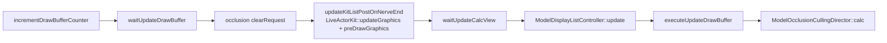

<h2 align="center">
    Running Super Mario Odyssey Above 60 FPS <br>
    (without speeding the game up)
</h2>

<br />

I set out with the goal of playing Super Mario Odyssey at 120 FPS, the refresh rate of my shiny new monitor (the Apple Studio Display XDR, which is SO good), but I was taken aback when I found out that there was no mod to do this. There were the occasional YouTube video of it supposedly happening. I believe that to be framegen or after-effects, I'm not quite sure. This was confusing since games like the Legends of Zelda: Tears of the Kingdom had mods which accomplished this goal, and yet, one of the most popular Switch games, Super Mario Odyssey, was lacking the a mod with the same functionality. Although I still don't quite understand what differentiates this mod from its Legends of Zelda: Tears of the Kingdom counterpart (I haven't researched that yet), I eventually got it working and outlined my experience here. 
<br />

## Contents

- [Section I. Why I couldn't just make a value like `1/60` -> `1/120`](#section-i)
- [Section II. Getting a dump of the 1.0.0 ExeFS](#section-ii)
- [Section III. Turning it into something we can search](#section-iii)
- [Section IV. Finding the frame loop](#section-iv)
- [Section V. Finding the game tick, one crash at a time](#section-v)
- [Section VI. What a hook actually writes](#section-vi)
- [Section VII. Refusing to run on the wrong version](#section-vii)
- [Section VIII. Running the tick at 60 Hz, and blending the frames in between](#section-viii)
- [Section IX. Getting the Switch emulator to actually present faster](#section-ix)
- [Section X. Building it, installing it, and checking it works](#section-x)
- [Section XI. Where it stands](#section-xi)
- [Definitions](#definitions)

<br />

## Section I.
### Why I couldn't just make a value like `1/60` -> `1/120`, or press `CTRL+u`. 

SMO's (Super Mario Odyssey) logic is fixed-timestep. One call of the game tick is exactly `1/60` of a second of game time, and so we can logically assume  that animations advance one frame per tick, and the same can be said about physics and so on. There is no delta time to rescale. This means that if the game presents 120 frames a second, it also simulates 120 ticks a second, and Mario would therefore run at double speed.

Most FPS patches look for "the frame cap" constant of `1/60`, or just 60. Let's see how many candidates there are in the 1.0.0 executable.

- **Counting** `60.0f` **and** `1/60` **in the decompressed** `main`**.**

```python
$ cat > count.py << "EOF"
import struct
d = open('main-1.0.0.raw', 'rb').read()
for name, f in [('60.0f', 60.0), ('1/60 (0x3c888889)', None)]:
    pat = struct.pack('<f', f) if f is not None else struct.pack('<I', 0x3c888889)
    print(f'{name:18} {pat.hex()}  {d.count(pat)} occurrences')
EOF
```

> This needs `main-1.0.0.raw`, the decompressed 1.0.0 executable made in [Section II](#section-ii). Review that section for more details.

```bash
$ python3 count.py
60.0f              00007042  96 occurrences
1/60 (0x3c888889)  8988883c  2 occurrences
```

96 copies of `60.0f`, scattered through code and data. None of them is "the cap", because there is no cap to raise: the game waits on vsync, and its logic runs once per vsync. Changing any of them changes *something*, but it can't separate the simulation rate from the draw rate.

**So instead of patching bytes, we keep the game tick at exactly 60 Hz and interpolate.** 

What is interpolation? Interpolation here could be defined as drawing extra frames between two ticks by blending the last two game states: `prev + (curr - prev) * t`, where `t` (0 to 1) is how far between the two ticks the frame falls. At 120 Hz, each tick is drawn twice, at `t ~= 0` and `t ~= 0.5`. 

The use of this method requires that we run code inside the game, which lead me to [exlaunch](https://github.com/shadowninja108/exlaunch), which injects C++ into a Switch game as an extra module. 

<br />

## Section II.
### Getting a dump of the 1.0.0 ExeFS.

A code mod needs to know where functions and structure fields are. [OdysseyDecomp](https://github.com/MonsterDruide1/OdysseyDecomp), the community decompilation of SMO, gives us names and addresses, but only for **1.0.0**. So everything here targets 1.0.0, and the mod refuses to run on anything else.

The game's code lives in its ExeFS, a small filesystem inside the game's Program NCA, holding `main` (the game itself), `rtld` (the dynamic linker), `sdk` (Nintendo's SDK), `subsdk0` and `main.npdm` (the process's permissions). All of this compressed into an NSP and encrypted, so a hex editor or objdump can't read it until it's decrypted with keys from your own console.

We need to read the decrypted output, which there are two ways to get, you could either do it by hand from the NSP with [`hactool`](https://github.com/SciresM/hactool), or just have the Switch emulator do it. Both will output the same five files. I'll demonstrate both for documentation purposes.

### What you need, from your own Switch

- **The game.** The base game, version 0 (1.0.0), as an NSP, dumped from your own cartridge or eShop copy with a homebrew dumper such as [nxdumptool](https://github.com/DarkMatterCore/nxdumptool) on a Switch running custom firmware.
- **Your console's keys.** `prod.keys`, dumped from the same Switch with [Lockpick_RCM](https://github.com/shchmue/Lockpick_RCM). It writes `sd:/switch/prod.keys`. Copy it to `~/.switch/prod.keys`, which is where `hactool` looks by default. The Switch emulator asks for the same file.

### Using `hactool`.

First you must install it, whether that be building, or installing an existing build, it can be obtained from [SciresM/hactool](https://github.com/SciresM/hactool) here on GitHub.

- **What's an NSP?** Let's look at the first 64 bytes.

```bash
$ NSP="SMO.nsp" # This name varies
$ xxd -l 64 "$NSP"
00000000: 5046 5330 0800 0000 4001 0000 0000 0000  PFS0....@.......
00000010: 0000 0000 0000 0000 0007 0000 0000 0000  ................
00000020: 0000 0000 0000 0000 0007 0000 0000 0000  ................
00000030: c002 0000 0000 0000 2600 0000 0000 0000  ........&.......
```

It's a **PFS0**, Nintendo's simplest archive format:

- `50465330` **magic** = `"PFS0"`
- `08000000` **file count** = 8
- `40010000` **string-table size** = `0x140`
- `00000000` reserved
- then 8 entries of 24 bytes each: `u64` offset, `u64` size, `u32` name offset, `u32` reserved. The first entry is offset `0x0`, size `0x700`; the second is offset `0x700`, size `0x2c0`.
- then the string table of file names, then the file data.

No keys are needed to read a PFS0, so we give hactool an empty key file:

```bash
$ hactool -k /dev/null -t pfs0 "$NSP"
PFS0:
Magic:                              PFS0
Number of files:                    8
Files:                              pfs0:/01000000000100000000000000000003.cert 000000000000-000000000700
                                    pfs0:/01000000000100000000000000000003.tik 000000000700-0000000009c0
                                    pfs0:/0f26bd42cae0e4cefda4b5bbf7ae3d50.nca 0000000009c0-00014a2909c0
                                    pfs0:/16d1e6498dbc7ea9857876b8e7ff2a38.nca 00014a2909c0-00014a2c45c0
                                    pfs0:/3af7b8fb156a98b26c2a9dda1dafe7d2.nca 00014a2c45c0-00014e6005c0
                                    pfs0:/c3c89de8b7652af2b185c07612423cd3.cnmt.nca 00014e6005c0-00014e6013c0
                                    pfs0:/c3c89de8b7652af2b185c07612423cd3.cnmt.xml 00014e6013c0-00014e601a31
                                    pfs0:/d6cf78dae4072c6a0004ac6ac7a016aa.nca 00014e601a31-00014e713431
Done!
```

`hactool -t pfs0 --outdir=` would extract all 5.6 GB. We only need two of these files, so here's a tiny extractor that follows the layout above:

```python
$ cat > pfs0.py << "EOF"
import struct, sys
# PFS0: "PFS0", u32 file count, u32 string-table size, u32 reserved,
# then 24-byte entries (u64 offset, u64 size, u32 name offset, u32 reserved), then the string table.
nsp, wanted = sys.argv[1], sys.argv[2:]
with open(nsp, 'rb') as f:
    magic, count, strsz, _ = struct.unpack('<4sIII', f.read(16))
    assert magic == b'PFS0'
    entries = [struct.unpack('<QQII', f.read(24)) for _ in range(count)]
    strings = f.read(strsz)
    data = 16 + 24 * count + strsz
    for off, size, name_off, _ in entries:
        name = strings[name_off:strings.index(b'\0', name_off)].decode()
        if not wanted:
            print(f'{name:40} {size:>12}')
        elif name in wanted:
            f.seek(data + off)
            with open(name, 'wb') as out:
                left = size
                while left:
                    chunk = f.read(min(left, 1 << 24))
                    out.write(chunk)
                    left -= len(chunk)
            print(f'extracted {name} ({size} bytes)')
EOF
```

```bash
$ python3 pfs0.py "$NSP"
01000000000100000000000000000003.cert                    1792
01000000000100000000000000000003.tik                      704
0f26bd42cae0e4cefda4b5bbf7ae3d50.nca               5539168256
16d1e6498dbc7ea9857876b8e7ff2a38.nca                   211968
3af7b8fb156a98b26c2a9dda1dafe7d2.nca                 70500352
c3c89de8b7652af2b185c07612423cd3.cnmt.nca                3584
c3c89de8b7652af2b185c07612423cd3.cnmt.xml                1649
d6cf78dae4072c6a0004ac6ac7a016aa.nca                  1120768
```

- **Which NCA is the code?** The `.cnmt.xml` is the content metadata, in plain text:

```bash
$ python3 pfs0.py "$NSP" c3c89de8b7652af2b185c07612423cd3.cnmt.xml
extracted c3c89de8b7652af2b185c07612423cd3.cnmt.xml (1649 bytes)
$ grep -E "<(Type|Id|Size)>" c3c89de8b7652af2b185c07612423cd3.cnmt.xml
  <Type>Application</Type>
  <Id>0x0100000000010000</Id>
    <Type>Program</Type>
    <Id>0f26bd42cae0e4cefda4b5bbf7ae3d50</Id>
    <Size>5539168256</Size>
    <Type>Control</Type>
    <Id>d6cf78dae4072c6a0004ac6ac7a016aa</Id>
    <Size>1120768</Size>
    <Type>LegalInformation</Type>
    <Id>16d1e6498dbc7ea9857876b8e7ff2a38</Id>
    <Size>211968</Size>
    <Type>HtmlDocument</Type>
    <Id>3af7b8fb156a98b26c2a9dda1dafe7d2</Id>
    <Size>70500352</Size>
    <Type>Meta</Type>
    <Id>c3c89de8b7652af2b185c07612423cd3</Id>
    <Size>3584</Size>
```

- `Program` holds the ExeFS (code) and RomFS (assets): `0f26bd42…`, the big one.
- `Control` is the icon and title names, `LegalInformation` and `HtmlDocument` are the manual and licences, and `Meta` is this metadata in binary form.

```bash
$ python3 pfs0.py "$NSP" 01000000000100000000000000000003.tik 0f26bd42cae0e4cefda4b5bbf7ae3d50.nca
extracted 01000000000100000000000000000003.tik (704 bytes)
extracted 0f26bd42cae0e4cefda4b5bbf7ae3d50.nca (5539168256 bytes)
```

- **The ticket.** The Program NCA is encrypted with a **title key**, and the `.tik` holds that title key, itself encrypted. Let's read the fields that aren't secret:

```bash
$ T=01000000000100000000000000000003.tik
$ xxd -l 4 $T
00000000: 0400 0100                                ....
$ xxd -s 0x140 -l 0x40 $T
00000140: 526f 6f74 2d43 4130 3030 3030 3030 332d  Root-CA00000003-
00000150: 5853 3030 3030 3030 3230 0000 0000 0000  XS00000020......
00000160: 0000 0000 0000 0000 0000 0000 0000 0000  ................
00000170: 0000 0000 0000 0000 0000 0000 0000 0000  ................
$ xxd -s 0x280 -l 0x30 $T
00000280: 0200 0000 0000 0300 0000 0000 0000 0000  ................
00000290: 0000 0000 0000 0000 0000 0000 0000 0000  ................
000002a0: 0100 0000 0001 0000 0000 0000 0000 0003  ................
```

| Offset | Bytes | Field |
|---|---|---|
| `0x000` | `04000100` | signature type `0x10004`: RSA-2048 with SHA-256 |
| `0x140` | `Root-CA00000003-XS00000020` | issuer |
| `0x180` | *(not shown)* | **title-key block**: the encrypted title key is its first 16 bytes |
| `0x280` | `02` | format version 2 |
| `0x281` | `00` | title-key type 0: **common**, meaning the title key is encrypted with a key from `prod.keys`, not with your console's personal key |
| `0x285` | `03` | master-key revision |
| `0x2a0` | `0100000000010000 0000000000000003` | **rights ID**: the title ID, then the key generation. It's also the ticket's file name. |

- **The keys.** This hactool release stops on any key that isn't exactly 32 hex digits, and newer key files have some longer ones. Let's see which, printing names only:

```bash
$ wc -l < ~/.switch/prod.keys
231
$ awk -F' *= *' 'length($2) == 34 { print $1 }' ~/.switch/prod.keys
mariko_master_kek_source_05
mariko_master_kek_source_06
…
mariko_master_kek_source_15
master_kek_source_06
master_kek_source_07
…
master_kek_source_15
```

33 names in all. SMO 1.0.0 only needs keys from master-key revision 2, so a copy without those lines is fine:

```bash
$ awk -F' *= *' 'length($2) != 34' ~/.switch/prod.keys > prod.keys
$ wc -l < prod.keys
198
```

- **Decrypting the Program NCA and saving its ExeFS.** hactool takes the encrypted title key from the ticket with `--titlekey=` and decrypts it itself. The `$(…)` passes it straight through without ever printing it.

```bash
$ hactool -k prod.keys --titlekey=$(xxd -p -s 0x180 -l 16 $T) --exefsdir=exefs 0f26bd42cae0e4cefda4b5bbf7ae3d50.nca
NCA:
Magic:                              NCA3
Fixed-Key Index:                    0x0
Fixed-Key Signature:                <hidden>
NPDM Signature:                     <hidden>
Content Size:                       0x00014a290000
Title ID:                           0100000000010000
SDK Version:                        3.5.1.0
Distribution type:                  Download
Content Type:                       Program
Master Key Revision:                0x2 (3.0.1-3.0.2)
Encryption Type:                    Titlekey crypto
Rights ID:                          01000000000100000000000000000003
Titlekey (Encrypted) (From CLI)     <hidden>
Titlekey (Decrypted) (From CLI)     <hidden>
NPDM:
    Magic:                          META
    MMU Flags:                      7
    Main Thread Priority:           44
    Default CPU ID:                 0
    Version:                        0.0.0-0 (0)
    Main Thread Stack Size:         0x100000
    Title Name:                     Application
    …
    Kernel Access Control:
        Lowest Allowed Priority:    28
        Highest Allowed Priority:   59
        Lowest Allowed CPU ID:      0
        Highest Allowed CPU ID:     2
        Allowed SVCs:               svcSetHeapSize                      (0x01)
                                    …
                                    svcFlushProcessDataCache            (0x5f)
    …
Sections:
    Section 0:
        Offset:                     0x000148cd4000
        Size:                       0x0000015bc000
        Partition Type:             ExeFS
        Section CTR:                <hidden>
        Superblock Hash:            <hidden>
        …
    Section 1:
        Offset:                     0x00000001c000
        Size:                       0x000148cb8000
        Partition Type:             RomFS
        …
    Section 2:
        Offset:                     0x000000004000
        Size:                       0x000000018000
        Partition Type:             PFS0
        …

Saving main to exefs/main...
Saving main.npdm to exefs/main.npdm...
Saving rtld to exefs/rtld...
Saving sdk to exefs/sdk...
Saving subsdk0 to exefs/subsdk0...

Done!
```

> `…` marks lines left out: signature and hash dumps, the full NPDM access-control lists, and per-level hash tables. The real output is about 200 lines.

A few things are worth reading here:

- **`Master Key Revision: 0x2 (3.0.1-3.0.2)`** is the key generation the game was built for, and it matches the ticket's rights ID.
- **The NPDM block** is `main.npdm` decoded: thread priority 44, a 1 MiB main stack, CPU cores 0–2, and the 47 system calls the game may use. SMOInterp ships its own `main.npdm` ([Section X](#section-x)), built from exlaunch's template in `config.json`. It keeps the same priority, stack and cores, and allows the same system calls plus three more: `svcWaitForAddress` (`0x34`), `svcSignalToAddress` (`0x35`) and `svcSynchronizePreemptionState` (`0x36`).
- **Section 0 is the ExeFS**, only about 22 MiB (`0x15bc000`) of the 5.5 GB NCA. Section 1, the RomFS, is the rest: models, textures, sound.

```bash
$ ls -l exefs/
total 22228
-rw-r--r-- 1 sam sam 15388240 Sep 29 19:41 main
-rw-r--r-- 1 sam sam     1476 Sep 29 19:41 main.npdm
-rw-r--r-- 1 sam sam     7099 Sep 29 19:41 rtld
-rw-r--r-- 1 sam sam  4179745 Sep 29 19:41 sdk
-rw-r--r-- 1 sam sam  3175954 Sep 29 19:41 subsdk0
```

Now delete the 5.5 GB NCA, the ticket and the key copy. Only `exefs/` is needed from here on.

```bash
$ rm 0f26bd42cae0e4cefda4b5bbf7ae3d50.nca $T prod.keys
```

### Using the Switch emulator to dump it.

If you make active use of your emulator, it should already have your keys, and you can therefore use it to write the ExeFS out while the game loads. 

- **Boot the game as 1.0.0, with no mods.** Right-click the game -> Properties -> Add-ons. Untick any updates, and untick any mods. The dump is taken *after* mods are layered into the ExeFS, so an enabled mod could add its own `main.npdm` and `subsdk9` to it.

- **Turn the dump on.** Emulation -> Configure -> System -> Filesystem, tick **Dump ExeFS**, and press **OK**. These options can only be changed while no game is running.

- **Start the game once.** The ExeFS is written while the game loads, so you can quit as soon as it's running. The emulator's log gets a line starting with `Dumping ExeFS for title_id=0100000000010000`.

- **Turn the dump back off**, because it runs again on every launch.

The files are the same five as if you used `hactool`, but in this case, they are in the emulator's data directory under `dump/0100000000010000/exefs/`. 

> [!NOTE]
> Avoid copying dumped files back into a mod folder The emulator loads anything in `load/…/exefs/` as a replacement for the game's own files, and a leftover or modified copy of `main` there is enough to stop the game from booting.

#### In Either Case

`main` is the file we are looking for. It's Nintendo's NSO executable format, still compressed exactly as it is inside the game. 
> The file has no extension, but its first four bytes give it away: `NSO0`, the format's magic number [(A fixed signature @ offset 0x0 that identifies the format)](https://switchbrew.org/wiki/NSO0). Try it yourself: `xxd -l 16 exefs/main`

- **Confirming the version.** An NSO stores its build ID at file offset `0x40`.

```bash
$ xxd -s 0x40 -l 16 exefs/main
00000040: 3ca1 2dfa af9c 82da 064d 1698 df79 cda1  <.-......M...y..
```

`3CA12DFAAF9C82DA064D1698DF79CDA1` is 1.0.0. If you see `b424be15…` instead, that's 1.3.0: the Update was still enabled.

- **Decompressing it.** The NSO's segments are LZ4-compressed. [hactool](https://github.com/SciresM/hactool) unpacks them. Decompressing needs no keys, so we point it at an empty key file; otherwise hactool loads `~/.switch/prod.keys` if you have one and prints warnings containing key values.

```bash
$ hactool -k /dev/null -t nso --uncompressed=main-1.0.0.raw exefs/main
NSO0:
    Build Id:                       3CA12DFAAF9C82DA064D1698DF79CDA100000000000000000000000000000000
    Sections:
        .text:                      00000000-00bf2000
        .rodata:                    00bf2000-01c4e000
        .rwdata:                    01c4e000-01e61400
        .bss:                       01e61400-025a8000
Done!
```

> The output file is the memory image with a `0x100`-byte NSO header in front of it. Every address in this guide is an offset into the image; add `0x100` to find it in the file.

<br />

## Section III.
### Turning it into something we can search.

`llvm-objdump` won't disassemble a raw blob, so we wrap the code in an ELF first.

```bash
$ python3 -c "open('text.bin','wb').write(open('main-1.0.0.raw','rb').read()[0x100:][:0x1c4e000])"
$ llvm-objcopy -I binary -O elf64-littleaarch64 \
      --rename-section .data=.text,alloc,load,readonly,code text.bin text.elf
$ llvm-objdump -d --no-show-raw-insn --triple=aarch64 --stop-address=0x1600000 text.elf > text.dis
$ wc -l text.dis
5725405 text.dis
```

5.7 million lines. We'll search it with `grep` rather than read it.

- **Names for addresses.** OdysseyDecomp's `data/file_list.yml` maps every 1.0.0 function to its offset.

```bash
$ grep -c "label:" OdysseyDecomp/data/file_list.yml
74171
```

- **Pointers.** Switch executables are position-independent, so every pointer stored in data (vtables, the GOT) is **zero in the file**, and is filled in at load time from `R_AARCH64_RELATIVE` relocations. We parse those from the module's own `.dynamic` section. This is `relocs.py`, which every script below `exec`s:

```python
import struct, re
d = open('main-1.0.0.raw', 'rb').read()[0x100:]
mod0 = struct.unpack_from('<I', d, 4)[0]              # the NSO starts with a branch; offset 4 points to MOD0
dyn = mod0 + struct.unpack_from('<i', d, mod0 + 4)[0] # MOD0+4: offset of .dynamic, relative to MOD0
tags, o = {}, dyn
while True:
    t, v = struct.unpack_from('<qQ', d, o); o += 16
    if t == 0: break
    tags.setdefault(t, v)
rela, relasz = tags[7], tags[8]                       # DT_RELA, DT_RELASZ
R = {}                                                # slot -> target, for R_AARCH64_RELATIVE
for i in range(relasz // 24):
    off, info, add = struct.unpack_from('<QQq', d, rela + i * 24)
    if info & 0xffffffff == 0x403: R[off] = add
lab, cur = {}, None                                   # address -> mangled name
for line in open('OdysseyDecomp/data/file_list.yml'):
    m = re.match(r'\s*- offset: (0x[0-9a-f]+)', line)
    if m: cur = int(m.group(1), 16); continue
    m = re.match(r'\s*label: (\S+)', line)
    if m and cur is not None: lab.setdefault(cur, m.group(1))
```

- **Two more helpers** that the rest of this guide leans on. `dis.py` disassembles one whole function by address and names every `bl`/`b` target; `callers.py` answers "who calls this?" by searching `text.dis`.

```python
$ cat > dis.py << "EOF"
import bisect, re, subprocess, sys
exec(open('relocs.py').read())
start = int(sys.argv[1], 16)
addrs = sorted(lab)
end = addrs[bisect.bisect_right(addrs, start)]
name = lambda a: subprocess.run(['c++filt', lab.get(a, hex(a))], capture_output=True, text=True).stdout.strip()
print(f'{name(start)}  {start:#x}-{end:#x}')
out = subprocess.run(['llvm-objdump', '-d', '--no-show-raw-insn', '--triple=aarch64',
                      f'--start-address={start:#x}', f'--stop-address={end:#x}', 'text.elf'],
                     capture_output=True, text=True).stdout
for line in out.splitlines():
    if not re.match(r'^\s*[0-9a-f]+:', line):
        continue
    line = re.sub(r'\s*<_binary_text_bin_start\+0x[0-9a-f]+>', '', line)
    m = re.search(r'\b(bl|b)\s+0x([0-9a-f]+)$', line)
    if m and int(m.group(2), 16) in lab:
        line += f'    ; {name(int(m.group(2), 16))}'
    print(line.replace('\t', ' ').replace(':      ', ':'))
EOF
```

```python
$ cat > callers.py << "EOF"
import bisect, re, subprocess, sys
exec(open('relocs.py').read())
addrs = sorted(lab)
name = lambda a: subprocess.run(['c++filt', lab.get(a, hex(a))], capture_output=True, text=True).stdout.strip()
for target in sys.argv[1:]:
    t = int(target, 16)
    print(f'{name(t)} is called from:')
    pat = re.compile(rf'^\s*([0-9a-f]+):\s+(bl|b)\s+0x{t:x}\b')
    seen = []
    for line in open('text.dis'):
        m = pat.match(line)
        if m:
            site = int(m.group(1), 16)
            fn = addrs[bisect.bisect_right(addrs, site) - 1]
            seen.append(f'  {site:x}: {m.group(2)}  in {name(fn)}')
    print('\n'.join(seen) if seen else '  (no direct calls)')
EOF
```

<br />

## Section IV.
### Finding the frame loop.

Every frame goes through the framework's `procFrame_`. Let's look it up.

```bash
$ grep -B2 "label: .*GameFrameworkNx.*proc" data/file_list.yml | grep -oE "0x[0-9a-f]+|_ZN\S+" | paste - - | c++filt
0x731c08    sead::GameFrameworkNx::procFrame_()
0x731d08    sead::GameFrameworkNx::procDraw_()
0x731fdc    sead::GameFrameworkNx::procCalc_()
0x8a6ab4    al::GameFrameworkNx::procFrame_()
0x8a6d14    al::GameFrameworkNx::procDraw_()
```

There are two. `sead` is Nintendo's base library, and `al` is SMO's own engine layer on top of it.

My very first build hooked the `sead` versions, since those were the first ones I found. It had one job: count frames and log every 120 of them. The emulator's log showed exlaunch's module map, then `hooks installed`, and then nothing, even after 30 seconds of gameplay. The hooks never ran, because `al::GameFrameworkNx` overrides them. We can prove which one actually runs by finding the class's vtable: search the relocations for a slot that points at `0x8a6ab4`.

```python
$ cat > vtable.py << "EOF"
import subprocess
exec(open('relocs.py').read())
print(f'{len(R)} R_AARCH64_RELATIVE relocations')
slots = [s for s, t in R.items() if t == 0x8a6ab4]
print('slots pointing at 0x8a6ab4:', [hex(s) for s in slots])
vptr = slots[0] - 0xe8
for off in (0x78, 0xe8, 0xf0, 0xf8, 0x100, 0x118, 0x120):
    t = R.get(vptr + off, 0)
    name = subprocess.run(['c++filt', lab.get(t, '?')], capture_output=True, text=True).stdout.strip()
    print(f'  vptr+{off:#05x}  {t:#08x}  {name}')
EOF
```

```bash
$ python3 vtable.py
174723 R_AARCH64_RELATIVE relocations
slots pointing at 0x8a6ab4: ['0x1de5270']
  vptr+0x078  0x732e38  sead::Framework::procReset_()
  vptr+0x0e8  0x8a6ab4  al::GameFrameworkNx::procFrame_()
  vptr+0x0f0  0x8a6d14  al::GameFrameworkNx::procDraw_()
  vptr+0x0f8  0x731fdc  sead::GameFrameworkNx::procCalc_()
  vptr+0x100  0x8a6f74  al::GameFrameworkNx::present_()
  vptr+0x118  0x7322b4  sead::GameFrameworkNx::waitForGpuDone_()
  vptr+0x120  0x7324cc  sead::GameFrameworkNx::setGpuTimeStamp_()
```

Exactly one vtable holds it. `procFrame_`, `procDraw_` and `present_` are overridden by `al`, while `procCalc_` is still `sead`'s. **So `al::GameFrameworkNx::procFrame_` at `0x8a6ab4` is the per-frame entry point, and it's where our clock goes.** Re-pointing the hooks there made the frame counter work.

Reading `procFrame_` itself, one frame goes: `present_` the **previous** frame, `procCalc_` (the logic), `procDraw_`, then wait for the GPU.

<br />

## Section V.
### Finding the game tick, one crash at a time.

"Run the game tick only every 1/60 s" needs a precise answer to *which function is the game tick*. Everything that runs once per frame turns out to fall into one of two groups:

- **Simulation**, which must run exactly 60 times a second.
- **Render bookkeeping**, which must run exactly once per draw.

Finding the line between them took me six attempts. Here they are, in order, with the evidence that forced each next one.

### Attempt 1: skip all of `procCalc_`.

`procCalc_` looks like "the logic", so my first gate skipped it entirely on in-between frames.

The title menu reached ~120 fps. Then loading into a kingdom gave a black screen, then 0 fps, and the emulator logged a backtrace starting at `PC=0x4`:

```
unknown       0000007100000004                          ← jumped to address 4
RedStar.nss   agl::utl::TextureMemoryAllocator::free(MemoryBlock*, bool)
RedStar.nss   agl::utl::DynamicTextureAllocator::free_(agl::TextureData const*)
RedStar.nss   agl::pfx::Bloom::drawGaussian_(…)
RedStar.nss   agl::pfx::Bloom::draw_(…)
RedStar.nss   al::BloomDirector::draw(…)
RedStar.nss   al::ViewRenderer::drawView(…)
RedStar.nss   StageScene::drawMain() const
```

The bloom post-effect frees a temporary texture, and that free jumped through a null pointer. Let's look at the allocator.

```bash
$ python3 dis.py 0x791938
agl::utl::DynamicTextureAllocator::calc()  0x791938-0x7919b0
  …
  79194c: ldr w8, [x19, #0x28]
  791950: orr w8, w8, #0x4000
  791954: str w8, [x19, #0x28]
  791958: ldrh w8, [x19, #0xb20]
  79195c: cbz w8, 0x7919a0
  …
  79196c: bl 0x775a68    ; agl::driver::GraphicsDriverMgr::waitDrawDone() const
  791970: ldrh w8, [x19, #0xb20]
  791974: ldr w9, [x19, #0xb10]
  791978: cmp w9, w8
  79197c: csel w21, w9, w8, lo
  791980: cbz w21, 0x79199c
  791984: ldr x20, [x19, #0xb18]
  791988: mov x0, x20
  79198c: bl 0x773544    ; agl::GPUMemAddrBase::deleteGPUMemBlock() const
  791990: add x20, x20, #0x18
  791994: sub w21, w21, #0x1
  791998: cbnz w21, 0x791988
  79199c: strh wzr, [x19, #0xb20]
  …
```

`calc` sets bit `0x4000` in the word at `+0x28`, then walks a list at `+0xb18` (count: a `u16` at `+0xb20`, capacity at `+0xb10`), frees every entry, and resets the count to 0. It's a **deferred-free list**, flushed once per `calc`.

```bash
$ python3 dis.py 0x792610
agl::utl::DynamicTextureAllocator::free_(agl::TextureData const*)  0x792610-0x792728
  …
  792634: ldrb w8, [x21, #0x29]
  792638: tbnz w8, #0x6, 0x79266c
  …
  79266c: ldr x1, [x20, #0x128]
  792670: ldr x8, [x1, #0x50]
  792674: cbz x8, 0x7926bc
  792678: ldrh w8, [x21, #0xb20]
  79267c: add w9, w8, #0x1
  792680: ldr x10, [x21, #0xb18]
  792684: strh w9, [x21, #0xb20]
  792688: ldr w9, [x21, #0xb10]
  79268c: orr w11, wzr, #0x18
  792690: madd x11, x8, x11, x10
  792694: cmp w9, w8
  792698: ldr x9, [x20, #0x128]
  79269c: csel x8, x11, x10, hi
  …
  7926f0: str xzr, [x20, #0x128]
  …
```

`free_` checks that bit (`ldrb [x21, #0x29]; tbnz #0x6` is bit 14 of the word). When it's set, it appends to the deferred list: `count++`, and `csel … hi` picks `&list[count]` only while `count < capacity`. **Otherwise it silently overwrites `list[0]`.** Either way, it then clears the texture's block pointer (`str xzr, [x20, #0x128]`).

So skipping `procCalc_` meant draws kept piling frees onto a list that was never flushed. Once it overflowed, entries overwrote entry 0, a texture got freed twice, and the second free found its block pointer already zeroed and jumped through it. **agl's per-frame bookkeeping lives in the framework half of `procCalc_`, and it assumes one calc per draw. The gate has to go lower.**

### Attempt 2: gate `GameSystem::movement`.

`procCalc_` runs the task tree, and the game's root task (`RootTask::calc`) calls `GameSystem::movement`. Let's list everything it calls.

```python
$ cat > calls.py << "EOF"
import bisect, re, subprocess, sys
exec(open('relocs.py').read())
start = int(sys.argv[1], 16)
addrs = sorted(lab)
end = addrs[bisect.bisect_right(addrs, start)]
dis = subprocess.run(['llvm-objdump', '-d', '--no-show-raw-insn', '--triple=aarch64',
                      f'--start-address={start:#x}', f'--stop-address={end:#x}', 'text.elf'],
                     capture_output=True, text=True).stdout
name = lambda a: subprocess.run(['c++filt', lab.get(a, hex(a))], capture_output=True, text=True).stdout.strip()
print(f'{name(start)}  {start:#x}-{end:#x}')
for m in re.finditer(r'^\s*([0-9a-f]+):\s+bl\s+0x([0-9a-f]+)', dis, re.M):
    print(f'  {m.group(1)}: bl {name(int(m.group(2), 16))}')
EOF
```

```bash
$ python3 calls.py 0x536614
GameSystem::movement()  0x536614-0x536820
  536630: bl al::ApplicationMessageReceiver::update()
  536648: bl al::GamePadSystem::setInvalidateDisconnectFrame(int)
  536650: bl al::GamePadSystem::update()
  53665c: bl al::NetworkSystem::updateBeforeScene()
  53668c: bl sead::GraphicsNvn::setDisplayBufferWindowCrop(int, int, int, int)
  5366c8: bl sead::GraphicsNvn::setDisplayBufferWindowCrop(int, int, int, int)
  5366f0: bl al::NerveExecutor::updateNerve()
  5366f8: bl al::AudioSystem::update()
  536704: bl al::NetworkSystem::updateAfterScene()
  536730: bl al::isEqualString(char const*, char const*)
  536778: bl al::LayoutSystem::prepareInitFontForChangeLanguage()
  536798: bl al::removeResourceCategory(sead::SafeStringBase<char> const&)
  5367a8: bl al::findNamedHeap(char const*)
  5367c0: bl al::findNamedHeap(char const*)
  5367d0: bl al::addResourceCategory(sead::SafeStringBase<char> const&, int, sead::Heap*)
  5367d4: bl al::clearFileLoaderEntry()
  5367e0: bl al::createCategoryResourceAll(sead::SafeStringBase<char> const&)
  5367ec: bl al::LayoutSystem::initFontForChangeLanguage()
  5367f8: bl al::MessageSystem::initMessageForChangeLanguage()
  536808: bl GameSystem::tryChangeSequence(char const*)
```

That's the whole game: pad input, the sequence -> scene nerve (`updateNerve`, which is where every actor runs), audio, and language-change handling. Everything else in `procCalc_` is framework work. So `procCalc_` went back to running every frame, and only `GameSystem::movement` at `0x536614` was gated.

Gameplay ran, but above 60 fps **the 3D scene was black while the HUD drew normally**, and a later session crashed in the same allocator, from the other direction:

```
agl::TextureData::setImagePtr ← agl::utl::TextureDataEx::reset ← DynamicTextureAllocator::alloc_
  ← DynamicTextureAllocator::alloc ← al::ViewRenderer::drawView ← StageScene::drawMain
```

So the scene's own drawing still depended on something the gated tick did.

### Attempt 3: replay the scene's graphics update.

Every scene ends its tick with `al::updateKitListPostOnNerveEnd`:

```bash
$ python3 dis.py 0x9d0ce4
al::updateKitListPostOnNerveEnd(al::Scene*)  0x9d0ce4-0x9d0d2c
  9d0ce4: str x19, [sp, #-0x20]!
  9d0ce8: stp x29, x30, [sp, #0x10]
  9d0cec: add x29, sp, #0x10
  9d0cf0: mov x19, x0
  9d0cf4: ldr x0, [x19, #0x90]
  9d0cf8: bl 0x910610    ; al::LiveActorKit::updateGraphics()
  9d0cfc: ldr x0, [x19, #0x90]
  9d0d00: cbz x0, 0x9d0d20
  9d0d04: ldr x8, [x0, #0x38]
  9d0d08: cbz x8, 0x9d0d20
  9d0d0c: ldr x8, [x0, #0x78]
  9d0d10: cbz x8, 0x9d0d20
  9d0d14: ldp x29, x30, [sp, #0x10]
  9d0d18: ldr x19, [sp], #0x20
  9d0d1c: b 0x910650    ; al::LiveActorKit::preDrawGraphics()
  9d0d20: ldp x29, x30, [sp, #0x10]
  9d0d24: ldr x19, [sp], #0x20
  9d0d28: ret
```

`scene+0x90` is the scene's `LiveActorKit`, and this runs its `updateGraphics` (per-actor graphics jobs) and `preDrawGraphics`: the scene's per-frame render preparation, which was now only running on ticks. **Fix:** remember which scene called `updateKitListPostOnNerveEnd` during the last tick, and call it again on draw-only frames.

Keeping a scene pointer around means it must be forgotten when the scene is destroyed. `al::Scene::~Scene` is at `0x9ce52c`, and `callers.py 0x9ce52c` lists 19 call sites, every one inside a derived scene's destructor (`DemoChangeWorldScene`, `StageScene`, `TitleMenuScene`, …). One hook there catches every scene type.

The world was visible, and it rendered at the higher rate.

### Attempt 4: dropped inputs.

Next problem: some button presses just didn't register.

The controllers are polled by `sead::ControllerMgr::calc` (`0x75b9a0`), a framework task: a loop over the controller list, calling each controller's `update` through its vtable. sead computes a press ("trigger") by comparing each poll with the previous one. With framework tasks now running at 120 Hz and the game reading input at 60 Hz, a press that began on an in-between frame was already "held" by the next tick, so its trigger was lost.

**Fix:** run `ControllerMgr::calc` only on logic frames. Inputs registered reliably after that.

### Attempt 5: buildings flickering in and out.

Now buildings flickered in and out, and at certain angles they disappeared completely until I moved the camera. Only with the mod. Geometry that vanishes until the camera moves smells like **occlusion culling**.

```bash
$ python3 callers.py 0x94ce1c 0x94ce3c 0x94cee8
al::ModelOcclusionCullingDirector::clearRequest() is called from:
  879794: bl  in al::GraphicsSystemInfo::clearGraphicsRequest()
al::ModelOcclusionCullingDirector::update() is called from:
  879970: bl  in al::GraphicsSystemInfo::updateGraphics()
al::ModelOcclusionCullingDirector::calc() is called from:
  9ce6b4: b  in al::Scene::movement()
```

- `update` **appends** every registered query to a request list (via `updateGraphics`, which my replay now ran every frame).
- `clearRequest` is the only thing that empties it, and it runs at the start of a tick.
- `calc`, which processes the results, only runs from `al::Scene::movement`, on ticks.

So every draw-only frame appended every query again without clearing, and `calc` still ran once per tick. That made me read all of `al::Scene::movement`, in the decomp (`lib/al/Library/Scene/Scene.cpp`):

```cpp
void Scene::movement() {
    if (mLiveActorKit)
        incrementDrawBufferCounter(mLiveActorKit);
    if (mSceneStopCtrl)
        mSceneStopCtrl->update();
    if (mScreenCoverCtrl)
        mScreenCoverCtrl->update();
    if (mLiveActorKit)
        waitUpdateDrawBuffer(mLiveActorKit);
    if (mAudioDirector)
        mAudioDirector->updatePre();

    updateNerve();
    control();

    if (mAudioDirector)
        mAudioDirector->updatePost();
    if (mLiveActorKit) {
        waitUpdateCalcView(mLiveActorKit);
        if (mLiveActorKit->getModelDisplayListController())
            mLiveActorKit->getModelDisplayListController()->update();
        executeUpdateDrawBuffer(mLiveActorKit);
        ModelOcclusionCullingDirector* modelOcclusionCullingDirector =
            mLiveActorKit->getGraphicsSystemInfo()->getModelOcclusionCullingDirector();
        if (modelOcclusionCullingDirector)
            modelOcclusionCullingDirector->calc();
    }
}
```

and in the 1.0.0 binary, where every field offset the mod needs is right there:

```bash
$ python3 dis.py 0x9ce604
al::Scene::movement()  0x9ce604-0x9ce6c4
  9ce604: str x19, [sp, #-0x20]!
  9ce608: stp x29, x30, [sp, #0x10]
  9ce60c: add x29, sp, #0x10
  9ce610: mov x19, x0
  9ce614: ldr x0, [x19, #0x90]
  9ce618: cbz x0, 0x9ce620
  9ce61c: bl 0xa69b9c    ; al::incrementDrawBufferCounter(al::LiveActorKit const*)
  9ce620: ldr x0, [x19, #0xa8]
  9ce624: cbz x0, 0x9ce62c
  9ce628: bl 0x9cf150    ; al::SceneStopCtrl::update()
  9ce62c: ldr x0, [x19, #0xb8]
  9ce630: cbz x0, 0x9ce638
  9ce634: bl 0x9d364c    ; al::ScreenCoverCtrl::update()
  9ce638: ldr x0, [x19, #0x90]
  9ce63c: cbz x0, 0x9ce644
  9ce640: bl 0xa69b24    ; al::waitUpdateDrawBuffer(al::LiveActorKit const*)
  9ce644: ldr x0, [x19, #0xc0]
  9ce648: cbz x0, 0x9ce650
  9ce64c: bl 0x80c0c0    ; al::AudioDirector::updatePre()
  9ce650: mov x0, x19
  9ce654: bl 0x9595d4    ; al::NerveExecutor::updateNerve()
  9ce658: ldr x8, [x19]
  9ce65c: ldr x8, [x8, #0x38]
  9ce660: mov x0, x19
  9ce664: blr x8
  9ce668: ldr x0, [x19, #0xc0]
  9ce66c: cbz x0, 0x9ce674
  9ce670: bl 0x80c0d0    ; al::AudioDirector::updatePost()
  9ce674: ldr x0, [x19, #0x90]
  9ce678: cbz x0, 0x9ce6b8
  9ce67c: bl 0xa69b54    ; al::waitUpdateCalcView(al::LiveActorKit const*)
  9ce680: ldr x0, [x19, #0x90]
  9ce684: ldr x8, [x0, #0x60]
  9ce688: cbz x8, 0x9ce698
  9ce68c: mov x0, x8
  9ce690: bl 0x941878    ; al::ModelDisplayListController::update()
  9ce694: ldr x0, [x19, #0x90]
  9ce698: bl 0xa69b1c    ; al::executeUpdateDrawBuffer(al::LiveActorKit const*)
  9ce69c: ldr x8, [x19, #0x90]
  9ce6a0: ldr x8, [x8, #0x38]
  9ce6a4: ldr x0, [x8, #0x988]
  9ce6a8: cbz x0, 0x9ce6b8
  9ce6ac: ldp x29, x30, [sp, #0x10]
  9ce6b0: ldr x19, [sp], #0x20
  9ce6b4: b 0x94cee8    ; al::ModelOcclusionCullingDirector::calc()
  9ce6b8: ldp x29, x30, [sp, #0x10]
  9ce6bc: ldr x19, [sp], #0x20
  9ce6c0: ret
```

The simulation (`updateNerve` + the virtual `control` at vtable `+0x38`) is wrapped in render bookkeeping: a double-buffered actor draw buffer that flips every movement, and an occlusion `calc` at the end. My draw-only frames were missing all of it.

- `scene+0x90` -> `LiveActorKit`
- `kit+0x38` -> `GraphicsSystemInfo`, whose `+0x988` -> `ModelOcclusionCullingDirector`
- `kit+0x60` -> `ModelDisplayListController`

**Fix:** draw-only frames now replay `Scene::movement` *without* `updateNerve`/`control`, in the game's own order. The occlusion `clearRequest` stands in for the simulation's `clearGraphicsRequest`:



The buildings stopped flickering. One thing remained: Peach's Castle.

### Attempt 6: Peach's Castle going darker.

In Peach's Castle, the whole scene would occasionally go darker for a moment, several times in a row. Something *added* per update without being cleared seemed likely again, and the castle is full of dynamic lights.

```bash
$ python3 callers.py 0x8c23fc 0x8c2500
al::PrePassLightKeeper::execute(al::ShadowDirector*) is called from:
  879854: bl  in al::GraphicsSystemInfo::updateGraphics()
al::PrePassLightKeeper::requestPointLight(sead::Vector3<float> const&, float, sead::Color4f const&, float, bool) is called from:
  8d0098: bl  in ''
  a5da24: bl  in al::EffectLightDirector::update(al::PrePassLightKeeper*)
```

```bash
$ python3 dis.py 0x8c23fc
al::PrePassLightKeeper::execute(al::ShadowDirector*)  0x8c23fc-0x8c2454
  8c23fc: stp x20, x19, [sp, #-0x20]!
  8c2400: stp x29, x30, [sp, #0x10]
  8c2404: add x29, sp, #0x10
  8c2408: ldr x8, [x0, #0x20]
  8c240c: cbz x8, 0x8c2448
  8c2410: ldr x8, [x0, #0xa28]
  8c2414: add x19, x0, #0xa20
  8c2418: cmp x8, x19
  8c241c: b.eq 0x8c2448
  8c2420: add x9, x8, #0x8
  8c2424: ldr x0, [x8, #0x10]
  8c2428: ldr x8, [x0]
  8c242c: ldr x8, [x8, #0x20]
  8c2430: ldr x20, [x9]
  8c2434: blr x8
  8c2438: cmp x20, x19
  8c243c: add x9, x20, #0x8
  8c2440: mov x8, x20
  8c2444: b.ne 0x8c2424
  8c2448: ldp x29, x30, [sp, #0x10]
  8c244c: ldp x20, x19, [sp], #0x20
  8c2450: ret
```

- `execute` walks the light list at `+0xa20` and calls each light's vtable `+0x20` method, which **submits the light into the light buffers**.
- `clear()` (`0x8c22c4`) is what empties those five buffers (`+0xa38`..`+0xa58`, each via its vtable `+0x70`), and it only runs on ticks.
- `requestPointLight` adds one-off lights, and its real caller, `EffectLightDirector::update`, runs in the simulation.

So on draw-only frames, `execute` resubmitted every registered light into buffers only the tick clears. They overflowed, and lights dropped out. Clearing them on draw-only frames would also have thrown away the effects' one-off lights. **Fix:** skip `execute` on draw-only frames, because the buffers already hold that tick's complete set.

### Where the gate ended up.

| Attempt | Result | Why |
|---|---|---|
| Skip all of `procCalc_` | Black screen, then crash in `agl::pfx::Bloom` | agl's `DynamicTextureAllocator` defers texture frees and expects one calc per draw; its deferred-free list overflowed and a texture was freed twice. |
| Gate `GameSystem::movement` only | 3D scene black, HUD fine, later crash | `al::Scene::movement` also does the scene's render bookkeeping. |
| + replay `updateKitListPostOnNerveEnd` | Renders, but buildings flicker | Occlusion `update` *appends* every query and only the tick clears them; draw buffers and occlusion `calc` still paired with ticks. |
| Gate `sead::ControllerMgr::calc` with the tick | Fixes dropped inputs | Pads polled at 120 Hz turned a press into "held" before the 60 Hz logic saw the trigger. |
| + replay all of `Scene::movement`'s render steps | Works | Draw-only frames run the scene's render work in the game's order, minus `updateNerve`/`control`. |
| + skip `PrePassLightKeeper::execute` on draw-only frames | Fixes lights going dark | Lights resubmit every update and only the tick clears the buffers. |

<br />

## Section VI.
### What a hook actually writes.

exlaunch hooks a function by overwriting its **first instruction** with a branch to our code, and moving that instruction into a trampoline so we can still call the original. That's only safe if the first instruction isn't PC-relative. Let's check all fifteen.

```bash
$ for a in 0x8a6ab4 0x536614 0x75b9a0 0x8c23fc 0x9d0ce4 0x910650 0x93fe7c 0x93fbc0 \
           0xb2b274 0xb2a928 0x887454 0xb38fd4 0x8799b4 0x899510 0x9ce52c; do
    llvm-objdump -d --triple=aarch64 --start-address=$a --stop-address=$(printf '0x%x' $((a+4))) text.elf | tail -n 1
  done
  8a6ab4: d10783ff         sub    sp, sp, #0x1e0
  536614: d10103ff         sub    sp, sp, #0x40
  75b9a0: f81c0ff7         str    x23, [sp, #-0x40]!
  8c23fc: a9be4ff4         stp    x20, x19, [sp, #-0x20]!
  9d0ce4: f81e0ff3         str    x19, [sp, #-0x20]!
  910650: aa0003e8         mov    x8, x0
  93fe7c: d10243ff         sub    sp, sp, #0x90
  93fbc0: d10203ff         sub    sp, sp, #0x80
  b2b274: fc190fe8         str    d8, [sp, #-0x70]!
  b2a928: d10203ff         sub    sp, sp, #0x80
  887454: f81e0ff3         str    x19, [sp, #-0x20]!
  b38fd4: fc1d0fe8         str    d8, [sp, #-0x30]!
  8799b4: f81d0ff5         str    x21, [sp, #-0x30]!
  899510: f81e0ff3         str    x19, [sp, #-0x20]!
  9ce52c: a9be4ff4         stp    x20, x19, [sp, #-0x20]!
```

All plain stack and register moves, so every one of them relocates cleanly.

Now, what goes in their place? Here's exlaunch's `HookFuncImpl` (`source/lib/hook/nx64/hook_impl.cpp`):

```c
552:        if (llabs(pc_offset) >= (mask >> 1)) {
570:            original[0] = 0x58000051u;  // LDR X17, #0x8
571:            original[1] = 0xd61f0220u;  // BR X17
586:            __sync_cmpswap(original, *original, 0x14000000u | (pc_offset & mask));  // "B" ADDR_PCREL26
```

In layman's terms

- If our callback is within ±128 MiB, it writes a single `B` (`0x14000000 | offset/4`).
- Otherwise it writes `LDR X17, #8; BR X17` followed by the 64-bit callback address.

To know which one we get, we need to know where things are loaded. exlaunch logs the module map at startup, so let's look in the emulator's log (`$LOG` is the emulator's log file).

```bash
$ grep "exlaunch\] \[" "$LOG"
[  12.685325] Debug.Emulated <Info> core/hle/kernel/svc/svc_debug_string.cpp:25:OutputDebugString: [SMOInterp|exlaunch] [ nnrtld      ]:     000000008048c000-0000000080490000
[  12.685346] Debug.Emulated <Info> core/hle/kernel/svc/svc_debug_string.cpp:25:OutputDebugString: [SMOInterp|exlaunch] [ RedStar.nss ]:     0000000080490000-0000000082a38000
[  12.685347] Debug.Emulated <Info> core/hle/kernel/svc/svc_debug_string.cpp:25:OutputDebugString: [SMOInterp|exlaunch] [ multimedia  ]:     0000000082a38000-00000000830f3000
[  12.685349] Debug.Emulated <Info> core/hle/kernel/svc/svc_debug_string.cpp:25:OutputDebugString: [SMOInterp|exlaunch] [ src         ]:     00000000830f3000-00000000845cd000
[  12.685369] Debug.Emulated <Info> core/hle/kernel/svc/svc_debug_string.cpp:25:OutputDebugString: [SMOInterp|exlaunch] [ nnSdk       ]:     00000000845cd000-0000000084fde000
```

`RedStar.nss` is SMO's `main` ("RedStar" is the game's codename), and `src` is our mod. They're about 44 MiB apart, so **every hook is a single `B`**. Our callbacks' offsets come straight from the built ELF:

```bash
$ llvm-nm -C src.elf | grep -E " t .*::Callback\(" | sort
00000000000087f0 t ControllerMgrCalc::Callback(void*)
0000000000008810 t PrePassLightKeeperExecute::Callback(void*, void*)
0000000000008830 t UpdateKitListPostOnNerveEnd::Callback(void*)
0000000000008860 t UpdatePartsGraphics::Callback(void*, void*)
00000000000088b0 t FluidSimulateWaveUpdate::Callback(void*, void*)
0000000000008a00 t ProcFrame::Callback(void*)
0000000000008b80 t LiveActorKitPreDrawGraphics::Callback(void*)
0000000000008c00 t EffectSystemPreprocess::Callback(void*)
0000000000008f30 t VfxSystemCalculateGroup::Callback(void*, int, float, int)
0000000000009040 t EmitterSetCalculate::Callback(void*, float, int, bool, void*)
00000000000090c0 t EmitterSetInitialize::Callback(void*, int, int, int, int, int, void*)
0000000000009100 t ModelCtrlUpdateModelDrawBuffer::Callback(void*, int)
0000000000009160 t ModelCtrlUpdateGpuBuffer::Callback(void*, int)
00000000000091c0 t SceneDtor::Callback(void*)
0000000000009220 t GameSystemMovement::Callback(void*)
0000000000009950 t smo::nvn::BootstrapLoader::Callback(char const*)
```

Putting the two together, `site = 0x80490000 + offset`, `callback = 0x830f3000 + symbol`, and `word = 0x14000000 | ((callback − site) >> 2)`:

```
main+0x8a6ab4  0x0080d36ab4 -> 0x00830fba00  148f13d3  ProcFrame::Callback
main+0x536614  0x00809c6614 -> 0x00830fc220  149cd703  GameSystemMovement::Callback
main+0x75b9a0  0x0080beb9a0 -> 0x00830fb7f0  14943f94  ControllerMgrCalc::Callback
main+0x8c23fc  0x0080d523fc -> 0x00830fb810  148ea505  PrePassLightKeeperExecute::Callback
main+0x9d0ce4  0x0080e60ce4 -> 0x00830fb830  148a6ad3  UpdateKitListPostOnNerveEnd::Callback
main+0x910650  0x0080da0650 -> 0x00830fbb80  148d6d4c  LiveActorKitPreDrawGraphics::Callback
main+0x93fe7c  0x0080dcfe7c -> 0x00830fc100  148cb0a1  ModelCtrlUpdateModelDrawBuffer::Callback
main+0x93fbc0  0x0080dcfbc0 -> 0x00830fc160  148cb168  ModelCtrlUpdateGpuBuffer::Callback
main+0xb2b274  0x0080fbb274 -> 0x00830fc040  14850373  EmitterSetCalculate::Callback
main+0xb2a928  0x0080fba928 -> 0x00830fc0c0  148505e6  EmitterSetInitialize::Callback
main+0x887454  0x0080d17454 -> 0x00830fbc00  148f91eb  EffectSystemPreprocess::Callback
main+0xb38fd4  0x0080fc8fd4 -> 0x00830fbf30  1484cbd7  VfxSystemCalculateGroup::Callback
main+0x8799b4  0x0080d099b4 -> 0x00830fb860  148fc7ab  UpdatePartsGraphics::Callback
main+0x899510  0x0080d29510 -> 0x00830fb8b0  148f48e8  FluidSimulateWaveUpdate::Callback
main+0x9ce52c  0x0080e5e52c -> 0x00830fc1c0  148a7725  SceneDtor::Callback
```

Let's make sure the assembler agrees with us about `GameSystem::movement`'s word (little-endian, so the bytes go in reverse):

```bash
$ echo 0x03 0xd7 0x9c 0x14 | llvm-mc --disassemble -triple=aarch64
    b    #41114636
```

`0x830fc220 − 0x809c6614 = 0x2735c0c = 41114636`. That's exactly the jump from `GameSystem::movement` into our callback. Inside the callback, `Orig(...)` calls the trampoline, which runs the displaced `sub sp, sp, #0x40` and branches back to `0x536618`.

### What each callback does with that control.

| Offset | Function | Callback |
|---|---|---|
| `0x8a6ab4` | `al::GameFrameworkNx::procFrame_` | Advance the fixed-timestep accumulator ([Section VIII](#section-viii)), call `Orig`, log rates every 2 s. |
| `0x536614` | `GameSystem::movement` | `Orig` only when a step is due; otherwise replay the scene's render bookkeeping ([Attempt 5](#attempt-5-buildings-flickering-in-and-out)). |
| `0x75b9a0` | `sead::ControllerMgr::calc` | `Orig` only on logic frames ([Attempt 4](#attempt-4-dropped-inputs)). |
| `0x8c23fc` | `al::PrePassLightKeeper::execute` | Skipped on draw-only frames ([Attempt 6](#attempt-6-peachs-castle-going-darker)). |
| `0x9d0ce4` | `al::updateKitListPostOnNerveEnd` | `Orig`, then remember the scene for replay. |
| `0x910650` | `al::LiveActorKit::preDrawGraphics` | Record the tick's camera, write the blended one ([The camera](#the-camera)). |
| `0x93fe7c` | `al::ModelCtrl::updateModelDrawBuffer` | Blend the bone matrices around the GPU upload, then restore them ([Every model's skeleton](#every-models-skeleton)). |
| `0x93fbc0` | `al::ModelCtrl::updateGpuBuffer` | Same, for the other upload path. |
| `0xb2b274` | `nn::vfx::EmitterSet::Calculate` | Blend where the effect is anchored ([Effect anchors](#effect-anchors)). |
| `0xb2a928` | `nn::vfx::EmitterSet::Initialize` | Forget a recycled slot's history. |
| `0x887454` | `al::EffectSystem::preprocess` | Recorded on ticks, replayed on draw-only frames ([Particles](#particles)). |
| `0xb38fd4` | `nn::vfx::System::Calculate(int, float, BufferSwapMode)` | `rate * frameTicks`; recorded on ticks, replayed on draw-only frames. |
| `0x8799b4` | `al::GraphicsSystemInfo::updatePartsGraphics` | Time step `* frameTicks`, restored after ([Water, sky and ripples](#water-sky-and-ripples)). |
| `0x899510` | `al::FluidSimulateWave::update` | `Orig` only on logic frames. |
| `0x9ce52c` | `al::Scene::~Scene` | Drop the saved scene and all history ([Attempt 3](#attempt-3-replay-the-scenes-graphics-update)). |

Plus one more, `nvnBootstrapLoader`, for the frame rate ([Section IX](#section-ix)).

<br />

## Section VII.
### Refusing to run on the wrong version.

Hooking the wrong build would overwrite random code with branches, so before any of the above, the mod checks it's on 1.0.0. The NSO header isn't mapped into memory, but GNU linkers put a build-ID **note** inside the image itself.

```bash
$ xxd -s $((0x100 + 0x1c4d014)) -l 32 main-1.0.0.raw
01c4d114: 0400 0000 1000 0000 0300 0000 474e 5500  ............GNU.
01c4d124: 3ca1 2dfa af9c 82da 064d 1698 df79 cda1  <.-......M...y..
```

- `04000000` **namesz** = 4
- `10000000` **descsz** = 16
- `03000000` **type** = 3, `NT_GNU_BUILD_ID`
- `474e5500` **name** = `"GNU\0"`
- then the 16-byte build ID, at `main+0x1c4d024`.

`exl_main` compares those 16 bytes with `3ca12dfa…cda1`. On a mismatch it logs `main is not SMO 1.0.0` and returns without installing a single hook.

<br />

## Section VIII.
### Running the tick at 60 Hz, and blending the frames in between.

At the top of every `procFrame_`, the mod reads the Switch's system tick (19.2 MHz, so one logic step is `19200000 / 60 = 320000` ticks) and runs a fixed-step accumulator (`source/program/main.cpp`):

```cpp
        u64 elapsed = now - s_LastFrameTick;
        s_FrameTicks = std::min(float(elapsed) / float(TicksPerLogicStep), 2.f);

        /* Cap the debt at two steps so a long stall (loading, breakpoint) doesn't fast-forward. */
        s_Accumulator = std::min(s_Accumulator + elapsed, 2 * TicksPerLogicStep);
        s_LastFrameTick = now;

        /* At most one logic step per rendered frame: below 60 fps the game slows down, as in vanilla. */
        s_RunCalcThisFrame = s_Accumulator >= TicksPerLogicStep;
        if (s_RunCalcThisFrame)
            s_Accumulator -= TicksPerLogicStep;

        /* Interpolation runs one tick behind (prev -> curr); extrapolation runs level with the game (curr -> next). */
        float leftover = std::min(float(s_Accumulator) / float(TicksPerLogicStep), 1.f);
```

The blend weight is `leftover` for `interpolation = on`, `1 + leftover` for `extrapolate`, and `1` for `off`. Every blend in the mod (the camera, every skeleton's bone matrices, every particle emitter's placement) is the same line (`source/program/history.hpp`):

```cpp
    inline void Blend(float* out, const float* prev, const float* curr, size_t count, float alpha) {
        for (size_t i = 0; i < count; ++i)
            out[i] = prev[i] + (curr[i] - prev[i]) * alpha;
    }
```

The blended values are written just before the renderer reads them and restored right after, so the simulation never sees them. Here's how I found each thing worth blending.

### The camera.

The camera was first, because it's what you notice most. The renderer reads each view's `sead::LookAtCamera`, and the game's small accessor functions give the structure:

```bash
$ python3 dis.py 0x83bb38; python3 dis.py 0x83ba08; python3 dis.py 0x83bbd4
al::getLookAtCamera(al::SceneCameraInfo const*, int)  0x83bb38-0x83bb48
  83bb38: ldr x8, [x0, #0x8]
  83bb3c: ldr x8, [x8, w1, sxtw #3]
  83bb40: ldr x0, [x8, #0x8]
  83bb44: ret
al::getViewMtx(al::SceneCameraInfo const*, int)  0x83ba08-0x83ba1c
  83ba08: ldr x8, [x0, #0x8]
  83ba0c: ldr x8, [x8, w1, sxtw #3]
  83ba10: ldr x8, [x8, #0x8]
  83ba14: add x0, x8, #0x8
  83ba18: ret
al::getProjection(al::SceneCameraInfo const*, int)  0x83bbd4-0x83bbe4
  83bbd4: ldr x8, [x0, #0x8]
  83bbd8: ldr x8, [x8, w1, sxtw #3]
  83bbdc: ldr x0, [x8, #0x10]
  83bbe0: ret
```

`SceneCameraInfo+0x8` is an array of views; each view holds its `LookAtCamera` at `+0x8` and its `Projection` at `+0x10`; the camera's view matrix is at `camera+0x8`. And `sead::LookAtCamera::doUpdateMatrix` (`0x75c238`), which rebuilds that matrix, starts by reading three vectors:

```bash
$ python3 dis.py 0x75c238 | grep -E "ldp s[0-9], s[0-9], \[x20, #0x(38|44|50)\]" | head -3
  75c254: ldp s0, s1, [x20, #0x38]
  75c258: ldp s3, s2, [x20, #0x44]
  75c2d8: ldp s0, s1, [x20, #0x50]
```

`pos` at `+0x38`, `at` at `+0x44`, `up` at `+0x50`. So a blended camera is just three vectors, plus a call to the game's own `doUpdateMatrix`.

**Where to write it.** `al::LiveActorKit::preDrawGraphics` (`0x910650`) is the single point where the scene's camera is copied for rendering (`kit+0x78` -> `CameraDirector`, `+0x10` -> `SceneCameraInfo`). Hooking its entry, the mod records the tick's true camera on the first call of each tick, writes the blend, and lets the game copy it. The true camera goes back at the start of the next `GameSystem::movement`, because camera code reads its own previous state.

**Cuts.** Blending across a warp or a cutscene edit would show one nonsense in-between frame, so a tick where the camera moves more than 10 m (1000 units) or turns more than 30° is treated as a cut and snaps. 30° in 1/60 s is 1800°/s, far faster than anyone turns the camera.

With only the camera blended, there was a clear jitter to Mario's movement, and moving objects had a doubling artifact. I could pin the jitter down to the camera being behind while Mario was drawn at his newest position, so his place on screen alternated between frames. The doubling I traced to `al::TemporalInterlace` (`update` at `0x87d4ac`), a temporal technique that combines the current frame with previous ones, which turns an alternating object into a double image. Blending the actors too fixed the cause, and it never came back. 

### Every model's skeleton.

`al::ModelCtrl` computes a model's pose on ticks (`ModelCtrl::calc` -> `nn::g3d::SkeletonObj::CalculateWorldMtx`, on `[[ModelCtrl+0]+0x38]`, i.e. ModelCtrl -> ModelObj -> SkeletonObj), and uploads it per frame in `updateModelDrawBuffer` (`0x93fe7c`) and `updateGpuBuffer` (`0x93fbc0`), on the engine's worker threads. Poses computed on ticks, uploaded per frame: that's the seam.

`nn::g3d` is Nintendo's SDK, so the decomp doesn't cover it, but its code is in `main`:

```bash
$ python3 dis.py 0xb24ff8 | grep -E "#0x50\]|#0x18\]|stp q1[67], q0, \[x20"
  b25018: ldrh w22, [x19, #0x50]
  b2501c: ldp x21, x20, [x19, #0x18]
  b2508c: stp q16, q0, [x20]
  b25094: stp q17, q0, [x20, #0x20]
```

In `CalculateWorldImpl`, the bone count is a `u16` at `+0x50`, the local and world matrix arrays are at `+0x18`/`+0x20`, and each world matrix is written as four 16-byte stores: **64 bytes per bone**, four float4 columns. `CalculateSkeleton` confirms the stride, in both of its loops (`lsl #6` is * 64):

```bash
$ python3 dis.py 0xb275a8 | grep -E "lsl #6|x19, #0x20\]"
  b2760c: ldr x14, [x19, #0x20]
  b27614: add x13, x14, x13, lsl #6
  b276d4: ldr x13, [x19, #0x20]
  b276d8: add x12, x13, x12, lsl #6
```

The hook records a model's world matrices on its first upload of each tick, then around every upload: saves the current matrices, writes the blend of the last two ticks, lets the upload run, and puts the saved copy back. A model that skipped a tick, or whose root moved more than 10 m, draws unblended.

Uploads run on several threads at once, so the per-skeleton history is a lock-free table keyed by the `SkeletonObj` address, with the matrices in a fixed 16 MiB arena (three buffers per bone: previous, current, saved).

Motion was smooth after this.

### Particles.

SMO uses Nintendo's `nn::vfx`, and each effect group is advanced by `nn::vfx::System::Calculate(int group, float rate, BufferSwapMode)` (`0xb38fd4`), called from `al::EffectGroupDrawer::execute`:

```bash
$ python3 dis.py 0xa5ccd8 | grep -E "#0x69\]|#0x6a\]|fmov|b 0xb38fd4"
  a5ccfc: ldrb w9, [x8, #0x69]
  a5cd04: ldrb w8, [x8, #0x6a]
  a5cd10: fmov s0, wzr
  a5cd3c: fmov s0, wzr
  a5cd5c: fmov s0, #1.00000000
  a5cd74: b 0xb38fd4    ; nn::vfx::System::Calculate(int, float, nn::vfx::BufferSwapMode)
```

The rate is hardcoded: `1.0`, or `0.0` when the pause flags at `+0x69`/`+0x6a` are set. One whole 60 Hz step per tick. And before the groups, `al::EffectSystem::preprocess` swaps buffers:

```bash
$ python3 dis.py 0x887454
al::EffectSystem::preprocess()  0x887454-0x887488
  887454: str x19, [sp, #-0x20]!
  887458: stp x29, x30, [sp, #0x10]
  88745c: add x29, sp, #0x10
  887460: mov x19, x0
  887464: ldr x0, [x19, #0x10]
  887468: str wzr, [x19, #0x3d0]
  88746c: bl 0xb38bc8    ; nn::vfx::System::BeginFrame()
  887470: ldr x0, [x19, #0x10]
  887474: bl 0xb39918    ; nn::vfx::System::SwapBuffer()
  887478: ldr x0, [x19, #0x398]
  88747c: ldp x29, x30, [sp, #0x10]
  887480: ldr x19, [sp], #0x20
  887484: b 0x8857ec    ; al::EffectShaderHolder::swapUbo()
```

So on logic frames the mod multiplies each group's rate by that frame's real length in ticks (~=0.5 at 120 fps) and records which groups ran; on draw-only frames it replays `preprocess` (the buffer swaps must stay paired with draws, like everything in [Section V](#section-v)) and the recorded groups at the fractional rate. Paused groups stay at 0.

### Effect anchors.

Effects attached to something moving (running dust, Cappy's trail) are placed by an `nn::vfx::EmitterSet` matrix the game sets on ticks. Now that sets are calculated every frame, they needed the same blending as bones.

```bash
$ python3 dis.py 0xb2c188
nn::vfx::EmitterSet::SetPos(nn::util::neon::Vector3fType const&)  0xb2c188-0xb2c1a4
  b2c188: ldr q0, [x1]
  b2c18c: orr w8, wzr, #0x1
  b2c190: str q0, [x0, #0x90]
  b2c194: ldr q0, [x1]
  b2c198: str w8, [x0, #0x18]
  b2c19c: str q0, [x0, #0xd0]
  b2c1a0: ret
```

`SetPos` writes the position into two matrices (`+0x90` and `+0xd0`) and sets `+0x18 = 1`, the flag that tells the set's emitters to rebuild. `SetMatrix` (`0xb2bfe4`) fills the same two 4x4 blocks, `+0x60..+0xe0`. Every calculation path goes through `EmitterSet::Calculate` (`0xb2b274`), so one hook blends that block and sets the flag, then restores both. `nn::vfx` recycles emitter-set slots, so a hook on `EmitterSet::Initialize` (`0xb2a928`) wipes a slot's history.

### Field of view.

Camera zooms change the fovy, which lives in the view's `al::Projection`. `setFovy` alone isn't enough:

```bash
$ python3 dis.py 0x9c06c8
al::Projection::setFovy(float)  0x9c06c8-0x9c06f8
  9c06c8: str x19, [sp, #-0x20]!
  9c06cc: stp x29, x30, [sp, #0x10]
  9c06d0: add x29, sp, #0x10
  9c06d4: fmov s1, #0.50000000
  9c06d8: mov x19, x0
  9c06dc: str s0, [x19, #0x1d8]
  9c06e0: fmul s0, s0, s1
  9c06e4: bl 0xbef0f8
  9c06e8: str s0, [x19, #0x1dc]
  9c06ec: ldp x29, x30, [sp, #0x10]
  9c06f0: ldr x19, [sp], #0x20
  9c06f4: ret
```

It only stores fovy and `tan(fovy/2)`, and rebuilds nothing. `al::Projection::setProj(near, far, fovy, aspect)` (`0x9c05f0`) calls `sead::PerspectiveProjection::set` and recomputes the frustum, and `calcMtx` (`0x9bffe8`) rebuilds the matrices. On ticks where the fovy changed, the mod saves the whole `0x1f0`-byte projection, calls `setProj` + `calcMtx` with the blended fovy, and restores it afterwards. Most ticks don't zoom, and then the projection is never touched.

### Water, sky and ripples.

A screenshot from a waterfall pool showed bright white streaks on the water around Mario. The water, ocean, sky and clouds are "parts graphics", updated through `updatePartsGraphics`:

```bash
$ python3 dis.py 0x8799b4
al::GraphicsSystemInfo::updatePartsGraphics(al::GraphicsUpdateInfo const&)  0x8799b4-0x879a04
  8799b4: str x21, [sp, #-0x30]!
  8799b8: stp x20, x19, [sp, #0x10]
  8799bc: stp x29, x30, [sp, #0x20]
  8799c0: add x29, sp, #0x20
  8799c4: ldr x21, [x0, #0x958]
  8799c8: mov x19, x1
  8799cc: add x20, x0, #0x950
  8799d0: b 0x8799ec
  8799d4: ldr x0, [x21, #0x10]
  8799d8: ldr x8, [x0]
  8799dc: ldr x8, [x8, #0x28]
  8799e0: mov x1, x19
  8799e4: blr x8
  8799e8: ldr x21, [x21, #0x8]
  8799ec: cmp x21, x20
  8799f0: b.ne 0x8799d4
  8799f4: ldp x29, x30, [sp, #0x20]
  8799f8: ldp x20, x19, [sp, #0x10]
  8799fc: ldr x21, [sp], #0x30
  879a00: ret
```

It walks a list at `+0x950` and calls each part's vtable `+0x28` `update(info)`. What's in `info`? Two of the parts tell us:

```bash
$ python3 dis.py 0x8a19c0 | sed -n '8,11p'
  8a19d8: ldr s0, [x1]
  8a19dc: ldr s1, [x19, #0x78]
  8a19e0: fadd s0, s0, s1
  8a19e4: str s0, [x19, #0x78]
$ python3 dis.py 0x899510 | sed -n '6,13p'
  899520: ldr w8, [x19, #0x338]
  899524: str w8, [x19, #0x33c]
  899528: ldr s0, [x1]
  89952c: fmov s1, w8
  899530: ldrsw x8, [x19, #0x328]
  899534: add x8, x19, x8, lsl #3
  899538: fadd s0, s1, s0
  89953c: str s0, [x19, #0x338]
```

`SineWave::update` does `phase += info.step`, and `FluidSimulateWave::update` (the ripples) does `prevTime = time; time += info.step`. **The first field is a time step, 1.0 per call.** These run with the render bookkeeping, which since [Attempt 5](#attempt-5-buildings-flickering-in-and-out) runs every frame, so all of them were animating at double speed. **Fix:** scale that step by the frame's share of a tick, and restore it after.

Ripples needed one more rule: `FluidSimulateWave::calcGpu` runs **one fixed simulation step** whenever `time − prevTime` isn't near zero, whatever its size. A half-size step is still a full ripple step. So `FluidSimulateWave::update` only runs on logic frames; on draw-only frames the difference stays 0 and the step is skipped.

A second screenshot showed Mario looking ghosted in the water. That one happens with the mod off too, so it's just how SMO's water looks in the emulator.

### Extrapolation.

Interpolation always draws between the previous tick and the newest, so the picture runs up to one tick (16.7 ms) behind. With `interpolation = extrapolate`, the weight runs from 1 to 2 instead: every blend above continues the last step's motion past the newest tick (`curr + (curr − prev) * leftover`). No added latency, at the cost of overshooting for one frame when motion changes suddenly: stopping, landing, hitting a wall. The cut and teleport rules still apply, so a warp shows the newest tick as-is.

| What | Where it's blended | Snaps (no blend) when |
|---|---|---|
| Camera position, target, up and FOV | `LiveActorKit::preDrawGraphics`, before the renderer copies the view | it jumps > 10 m or turns > 30° in one tick |
| Every model's bone world matrices | around `ModelCtrl::updateModelDrawBuffer` / `updateGpuBuffer` | the root moves > 10 m in one tick, or the model skipped a tick |
| Effect anchors (`EmitterSet` placement) | `EmitterSet::Calculate`, now run every frame | the set moved > 10 m, or its slot was reused |
| Particle simulation | `nn::vfx::System::Calculate(group, rate)`, rate * frame share | the group is paused (rate 0) |
| Water, sky and clouds | `updatePartsGraphics`, time step * frame share | never; ripples only step on logic frames |

<br />

## Section IX.
### Getting the Switch emulator to actually present faster.

None of this helps if the emulator only shows 60 frames a second. SMO sets its present interval through NVN, and it looks every NVN function up by name at runtime. So we hook the lookup itself. `nvnBootstrapLoader` is exported by `nnSdk`, and the linker leaves it as an import:

```bash
$ llvm-nm src.elf | grep -i nvnBootstrap
                 U nvnBootstrapLoader
```

Whenever the game asks for `nvnWindowSetPresentInterval` or `nvnWindowBuilderSetPresentInterval`, we hand back our own versions, which ignore the game's `1` and pass this instead (`source/program/nvn.cpp`):

```cpp
    int PresentInterval() {
        return (config::Get().fps * 5 + 1) / 3;
    }
```

Why `fps * 5/3`? Let's look at the emulator's compositor.

```bash
$ grep -rn "swap interval" src/core/hle/service/nvnflinger/
src/core/hle/service/nvnflinger/hardware_composer.cpp:24:        // As an extension, treat nonpositive swap interval as speed multiplier.
src/core/hle/service/nvnflinger/hardware_composer.cpp:33:        // As an extension, treat high swap interval as precise speed control.
src/core/hle/service/nvnflinger/hardware_composer.cpp:123:        // Skip them when calculating the swap interval for the main game.
src/core/hle/service/nvnflinger/hardware_composer.cpp:132:        // TODO: handle cases where swap intervals are relatively prime. So far,
src/core/hle/service/nvnflinger/hardware_composer.cpp:133:        // only swap intervals of 0, 1 and 2 have been observed, but if 3 were
```

```cpp
    if (swap_interval >= 5) {
        // As an extension, treat high swap interval as precise speed control.
        if (out_speed_scale) {
            *out_speed_scale = static_cast<f32>(swap_interval) / 100.f;
        }

        swap_interval = 1;
    }
```

and in `src/core/hle/service/vi/conductor.cpp`, the frame period gets divided by that scale:

```cpp
    speed_scale /= m_compose_speed_scale;

    const f32 effective_fps = 60.f / static_cast<f32>(m_swap_interval);
    s64 period = static_cast<s64>(speed_scale * (1000000000.f / effective_fps));
```

So an interval of `n >= 5` composites at `60 * n / 100` frames a second. For `fps = 120`, `(120 * 5 + 1) / 3 = 200`, and `60 * 200 / 100 = 120`.

### How I got to that number.

I didn't start from the source. My first attempt aimed for 144 and set an interval of 240, and the log measured 119.9 fps. I guessed the NVN driver was turning 240 into 0 (the source's other extension, "nonpositive = 2x speed"), but setting 0 directly gave 60 fps, which killed that idea.

Instead of guessing one value per play session, I made the mod sweep through intervals during a single run, holding each for three 2-second reports and throwing away the first as settling time. One session measured:

| Present interval | Measured render fps | Notes |
|---:|---:|---|
| 1 | 59.9 | normal |
| 0 | 59.9 | *not* 2x |
| −1 | 59.9 | *not* 4x |
| −2 | 59.9 | |
| 2 | 30.0 | normal half-rate vsync |
| 5 | 3.0 | 5/100 of 60 |
| 50 | 29.9 | 50/100 of 60 |
| 100 | 60.0 | |
| 120 | 72.0 | |
| 144 | 86.3 | |
| 200 | (crash) | the allocator crash from [Attempt 2](#attempt-2-gate-gamesystemmovement) |

From 5 up, it follows the source exactly: `fps = 0.6 * interval`. Zero and negative values do nothing through SMO's NVN. So why did 240 give 119.9 and not 144?

```bash
$ xrandr --current | grep -E " connected|\*"
DisplayPort-0 connected primary 5120x2880+5120+0 (normal left inverted right x axis y axis) 600mm x 330mm
   5120x2880    120.04*+  60.00 +  59.94 +  50.00 +  48.00 +  47.95 +
DisplayPort-1 connected 2880x5120+0+0 right (normal left inverted right x axis y axis) 600mm x 330mm
   5120x2880    120.04*+  60.00 +  59.94 +  50.00 +  48.00 +  47.95 +
```

My monitors run at 120.04 Hz, with vsync on. A game producing 144 frames a second on a 120 Hz display is capped at 120. That's the reason `fps` in the config should match your display, and why the default is 120.

<br />

## Section X.
### Building and Testing

#### Building

```bash
$ make package
# (one line per compiled source file)
Failed to get system_resource_size (field not present).
Failed to get version (field not present).
Failed to get process_category (field not present).
Failed to get optimize_memory_allocation (field not present).
Failed to get disable_device_address_space_merge (field not present).
Failed to get enable_alias_region_extra_size (field not present).
built ... src.npdm
linking src.elf
built ... src.nso
/home/sam/Projects/SMOInterp/mod/SMOInterp-v1.1.0.zip
```

> The `Failed to get …` lines are harmless. The npdm tool is noting fields `config.json` doesn't set, and it uses the defaults.

#### Testing

The mod reports through `svcOutputDebugString`, which the emulator writes to its log:

```
OutputDebugString: hooks installed
OutputDebugString: config: fps = 120, interpolation = on
OutputDebugString: render 119.6 fps, logic 60.3 steps/s
OutputDebugString: render 119.9 fps, logic 59.9 steps/s
OutputDebugString: render 119.9 fps, logic 59.9 steps/s
```

Now it renders 120 frames smoothly :)

<br />

## Section XI.
### Where it stands.

- **Input is still sampled at 60 Hz.** The game only reads input once per tick ([Attempt 4](#attempt-4-dropped-inputs)).
- **`interpolation = on` draws up to one tick (16.7 ms) behind.** `extrapolate` doesn't, but can overshoot for a frame.
- **HUD animations still step at 60 Hz.** Layouts aren't blended.
- **Only 1.0.0.** Every address here is from OdysseyDecomp's 1.0.0 map; supporting 1.3.0 would mean finding all of them again.
- **Not yet tested:** bosses, Odyssey warps, snapshot mode, 2-player mode, moon cutscenes.

<br />

## Definitions

- **Switch emulator:** yuzu and its forks. The ExeFS loader, `load/` layout, `OutputDebugString` logging and the swap-interval extension in Section IX are shared yuzu code.
- **Tick / logic step:** one `GameSystem::movement` call, 1/60 s of game time.
- **Interpolation:** drawing a frame between two ticks as `prev + (curr − prev) * t`, with `t` from 0 to 1. `interpolation = extrapolate` uses `t` from 1 to 2 instead.
- **Draw-only frame:** a rendered frame on which no tick runs.

<br />

## Further Reading

- **[internals.md](https://github.com/Scherso/SMOInterp/blob/main/docs/internals.md)** has fun diagrams :)
